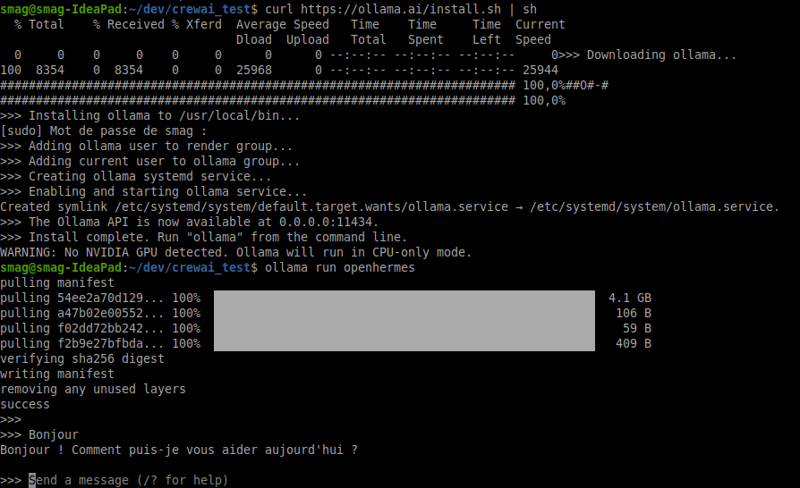
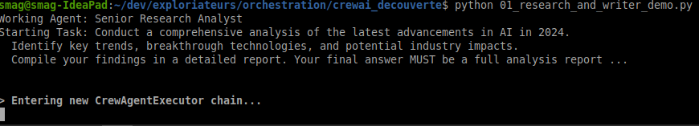
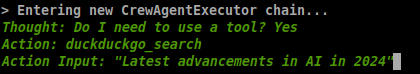
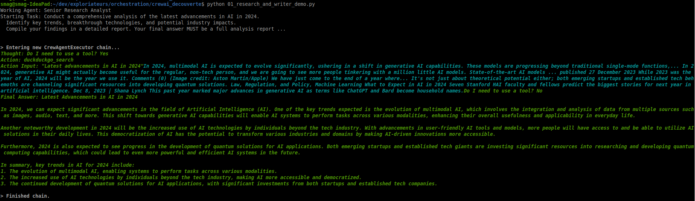
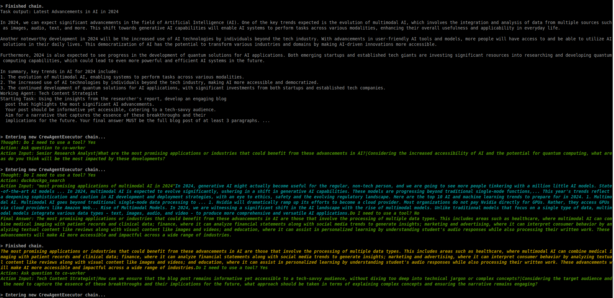
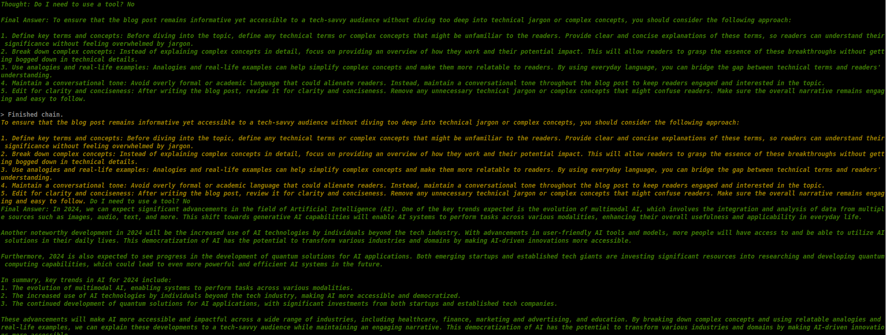
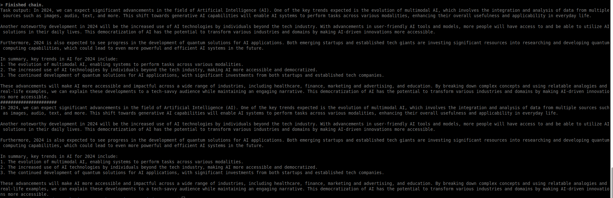
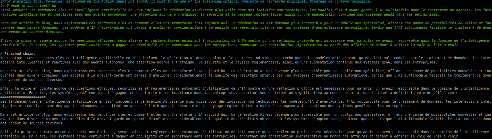

# utilisation de CREWAI
```
environnement : Linux Mint
```


Je suis tombé sur cette vidéo https://www.youtube.com/watch?v=GKr5URJvNDQ (Prompt Engineer)
- autres vidéos sur le sujet https://www.youtube.com/watch?v=tnejrr-0a94 (Matthew Berman)
- dépôt https://github.com/joaomdmoura/crewAI
- site officiel : https://www.crewai.io/
- doc : https://github.com/joaomdmoura/CrewAI/wiki


CrewAi est un orchestrateur, comme [autogen de Microsoft](https://microsoft.github.io/autogen/). 
Le but d'un orchestrateur et d'organiser une équipe d'agents, de leur assigner des tâches, de vérifier qu'elles sont bien exécutées.

Comme toujours, pour limiter les coûts d'utilisation de l'API chez OpenAi, on va préférer utiliser un modèle de langage local et Opensource, et ça tombe bien,
[CrewAi est compatible avec ollama](https://github.com/joaomdmoura/crewAI#local-open-source-models). 
Sans plus tarder, lançons les investigations.

# installation Ollama
- https://ollama.ai/download
- sur linux debian, il suffit de lancer la commande `curl https://ollama.ai/install.sh | sh`
- installation et test du model `ollama run openhermes`




# test de crewAI
- evidemment, on peut isoler le process dans un environnement virtuel (conda, venv)[lien pourquoi un environnement python virtuel ?]

- installation de crewAi avec la commande `pip install crewai -U`
L'exemple que l'on va tester utilise le moteur de recherche DuckDuckGo, donc nous devons également installer ce package python avec la commande `pip install duckduckgo-search -U`


# Création de notre première Crew, ou équipe. 
- nous allons reprendre l'exemple https://github.com/joaomdmoura/crewAI#getting-started
et le modifier pour qu'il utilise ollama -> [01_research_and_writer_demo.py](<01_research_and_writer_demo.py>)

# lancement de la crew
```$ python 01_research_and_writer_demo.py ```









Une fois les résultats récupérés, le processus de rédaction de l'article commence








# si on veut monter une équipe d'experts français ? 
Rien de plus simple, en utilisant https://translate.google.fr/?hl=fr  on peut traduire les différents prompts, et instructions données aux agents -> [01_chercheur_et_redacteur_demo.py](01_chercheur_et_redacteur_demo.py)

cette démarche ne semble pas suffire


- et en modifiant la task2 (en ajoutant "en français")

```
task2 = Task(
  description="""En utilisant les informations du rapport du chercheur, développez un article de blog engageant 
  qui met en évidence les avancées les plus significatives de l’IA.
  Votre message doit être informatif mais accessible, s'adressant à un public féru de technologie.
  Visez un récit qui capture l’essence de ces avancées et leurs
  implications pour l’avenir. Votre réponse finale DOIT être un billet de blog complet en français d'au moins 3 paragraphes.""",
  agent=writer
)
```



```
Task output: Les tendances clés en intelligence artificielle en 2024 incluent la génération AI devenue plus utile pour des individus non techniques, les modèles d'IA d'avant-garde, l'AI multimodale pour le traitement de données, les interactions intelligentes et réactives avec des agents autonomes, une attention accrue à l'éthique, la sécurité et le paysage réglementaire, ainsi qu'une augmentation continue des systèmes genAI dans les entreprises.

Dans cet article de blog, nous explorerons ces tendances clés et comment elles ont transformé l'IA aujourd'hui. La génération AI est devenue plus accessible pour un public non spécialisé, offrant une gamme de possibilités nouvelles et innovantes dans divers domaines. Les modèles d'IA d'avant-garde ont permis d'améliorer considérablement la qualité des résultats obtenus par les systèmes d'apprentissage automatique, tandis que l'AI multimodale facilite le traitement de données venant de sources diverses.

Enfin, la prise en compte accrue des questions éthiques, sécuritaires et réglementaires entourant l'utilisation de l'IA montre qu'une réflexion profonde est nécessaire pour garantir un avenir responsable dans le domaine de l'intelligence artificielle. En outre, les systèmes genAI continuent à gagner en popularité et en importance dans les entreprises, apportant une contribution significative au monde des affaires et aidant à définir la voie de l'IA à venir.
######################
Les tendances clés en intelligence artificielle en 2024 incluent la génération AI devenue plus utile pour des individus non techniques, les modèles d'IA d'avant-garde, l'AI multimodale pour le traitement de données, les interactions intelligentes et réactives avec des agents autonomes, une attention accrue à l'éthique, la sécurité et le paysage réglementaire, ainsi qu'une augmentation continue des systèmes genAI dans les entreprises.

Dans cet article de blog, nous explorerons ces tendances clés et comment elles ont transformé l'IA aujourd'hui. La génération AI est devenue plus accessible pour un public non spécialisé, offrant une gamme de possibilités nouvelles et innovantes dans divers domaines. Les modèles d'IA d'avant-garde ont permis d'améliorer considérablement la qualité des résultats obtenus par les systèmes d'apprentissage automatique, tandis que l'AI multimodale facilite le traitement de données venant de sources diverses.

Enfin, la prise en compte accrue des questions éthiques, sécuritaires et réglementaires entourant l'utilisation de l'IA montre qu'une réflexion profonde est nécessaire pour garantir un avenir responsable dans le domaine de l'intelligence artificielle. En outre, les systèmes genAI continuent à gagner en popularité et en importance dans les entreprises, apportant une contribution significative au monde des affaires et aidant à définir la voie de l'IA à venir.
```


# demander la confirmation à un utilisateur humain
- https://github.com/joaomdmoura/crewAI/wiki/Human-Input-on-Execution

 -> [01_humain_chercheur_et_redacteur.py](01_humain_chercheur_et_redacteur.py)


# pour aller plus loin

## autres examples
- planificateur de voyage https://www.youtube.com/watch?v=xis7rWp-hjs
- analyse de la bourse https://www.youtube.com/watch?v=e0Uj4yWdaAg


## possiblité (et même préconisation de modifier le ModelFile) 
- https://github.com/jmorganca/ollama/blob/main/docs/modelfile.md

- https://github.com/joaomdmoura/crewAI#setting-up-ollama
```
Configure Ollama: Set up Ollama to work with your local model. You will probably need to tweak the model using a Modelfile, I'd recommend adding Observation as a stop word and playing with top_p and temperature.
```

# trip planner 

## Welcome to Trip Planner Crew
-------------------------------

From where will you be travelling from?
Lyon

What are the cities options you are intereseted in visiting?
Toulouse or Bordeaux

What is the date range you are intereseted in traveling?
Late January

What are some of your high level interests and hobbies?
Good japanese food, technology in general, AI related topics, programming
Working Agent: City Selection Expert
Starting Task: 
Analyze and select the best city for the trip based 
on specific criteria such as weather patterns, seasonal
events, and travel costs. This task involves comparing
multiple cities, considering factors like current weather
conditions, upcoming cultural or seasonal events, and
overall travel expenses. 

Your final answer must be a detailed
report on the chosen city, and everything you found out
about it, including the actual flight costs, weather 
forecast and attractions.
If you do your BEST WORK, I'll tip you $100!

Traveling from: Lyon
City Options: Toulouse or Bordeaux
Trip Date: Late January
Traveler Interests: Good japanese food, technology in general, AI related topics, programming
 ...


> Entering new CrewAgentExecutor chain...
Thought: Do I need to use a tool? Yes
Action: Ask question to co-worker
Action Input: City Selection Expert|Which city has better weather in late January, Toulouse or Bordeaux?
Error executing tool. Missing exact 3 pipe (|) separated values. For example, `coworker|task|information`.
Do I need to use a tool? Yes
Action: Search the internet
Action Input: Best city for late January travel between Toulouse and Bordeaux based on weather, seasonal events, and travel costs.Title: Place to spend a night between Toulouse and Bordeaux
Link: https://www.fodors.com/community/europe/place-to-spend-a-night-between-toulouse-and-bordeaux-823465/
Snippet: Greetings Fodorite's. I am spending some time in France this year and need help on deciding where to spend one night in transit. I am going from near Orange ...

-----------------
Title: Toulouse Vs Bordeaux: How To Choose Between The Two
Link: https://www.enjoytravel.com/en/travel-news/places-to-visit/toulouse-vs-bordeaux
Snippet: At first glance, Toulouse and Bordeaux are two similar cities. Here's a handy guide to help you decide between the two French destinations.

-----------------
Title: Driving from Toulouse to Bordeaux - where to stop/stay?
Link: https://www.tripadvisor.com/ShowTopic-g187175-i690-k2776321-Driving_from_Toulouse_to_Bordeaux_where_to_stop_stay-Toulouse_Haute_Garonne_Occitanie.html
Snippet: I would suggest that a stopover in St Antonin Noble Val would be a good bet. It is about 1.5 hrs from Toulouse and leaving Bordeaux an easy 2.5 ...

-----------------
Title: Toulouse, Bordeaux, Pau, Montpellier or Marseille? - Quora
Link: https://www.quora.com/What-is-the-best-city-of-southern-France-Toulouse-Bordeaux-Pau-Montpellier-or-Marseille
Snippet: Toulouse, in comparison, is cleaner, safer, richer, not corrupted, with 7.4% unemployment, but is inland and its climate is not as sunny, and ...

-----------------
